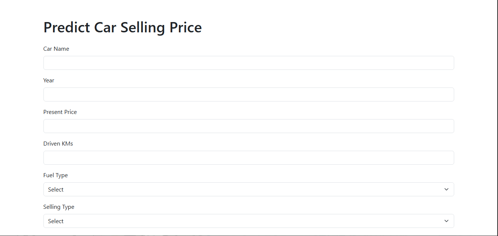
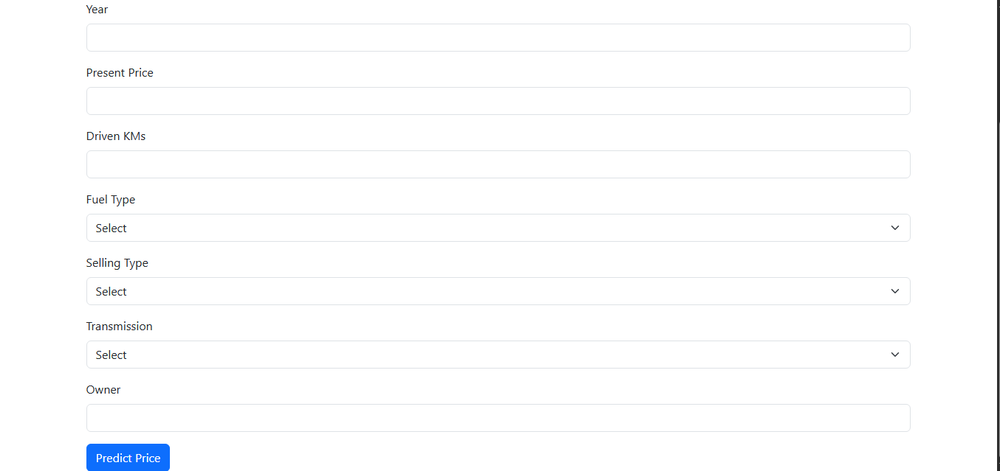
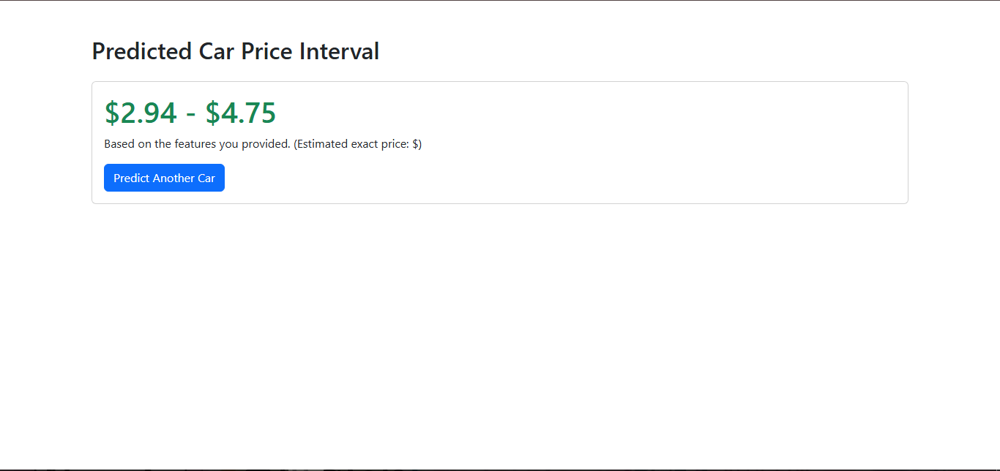

# 🚗 Car Price Prediction (End-to-End ML Project)

## 📌 Overview
This is a **Full-Stack, End-to-End Machine Learning project** completed as part of the **CodeAlpha Data Science Internship**. 
The application predicts the **selling price of cars** based on various features like present price, driven kilometers, fuel type, and ownership history. 

The project is designed to mimic a **real-world production environment**—it goes beyond a simple Jupyter notebook and integrates:
- **Data Preprocessing & Feature Engineering**
- **Machine Learning Model Training**
- **Model Persistence & Serialization**
- **Flask Web Application (Frontend + Backend)**
- **Prediction Logging & Monitoring (SQLite Database)**

---
## 📸 Screenshots 



---
## 🏗️ Architecture (Tech Stack)

| Layer | Technology |
| :--- | :--- |
| **Data Processing** | Pandas, NumPy, Scikit-Learn (`ColumnTransformer`, `Pipeline`) |
| **Machine Learning** | `RandomForestRegressor`, `XGBoost`, `Cross-Validation` |
| **Model Persistence** | `joblib` (`.pkl` files) |
| **Backend / API** | Python, `Flask`, `argparse` |
| **Frontend** | HTML, CSS (Bootstrap 5) |
| **Database** | `SQLite` (for logging predictions) |
| **Error Handling** | `try-except` blocks |

---

## 📁 Project Structure

```text
car_price_prediction/
├── models/                    # Trained model & preprocessor files
│   ├── model.pkl
│   └── preprocessor.pkl
|   |__residual_std.pkl
├── screenshots/                       # Screenshots of the project 
│   ├── Capture1.png
│   ├── Capture2.png         
│   └── Capture3.png       
├── src/                       # Modular, production-ready code
│   ├── __init__.py
│   ├── data_loader.py         # Loads raw data
│   ├── preprocessing.py       # Imputation, One-Hot Encoding, Feature Eng.
│   ├── model.py               # Defines the model
│   ├── train.py               # Fits & saves the model
│   └── predict.py             # Makes predictions & logs to DB
|__notebooks/
|   |__CarPricePredictionMLModel.ipynb
├── dataset/                      # Dataset (Ignored by Git due to size)
│   └── README.md
├── app.py                     # Flask Web Application
├── templates/
│   ├── index.html             # User input form
│   └── result.html            # Output display
├── requirements.txt
├── .gitignore
|__.env.example                # Template that show how to create your own .env file
└── db_init.py                 # Create database to store the features + predicted preice of input cars
└── BUGS.md                    # documenting major bugs faced during developement
└── schema.sql                 # schema of the database
└── README.md
```
## 🚀 Getting Started

### 1. Clone the repository
```bash
git clone https://github.com/asmaamouhouche2007-cloud/CodeAlpha_Car_Price_Prediction.git
cd CodeAlpha_Car_Price_Prediction
```

### 2. Create and activate a virtual environment
```bash
# On Windows
python -m venv venv
venv\Scripts\activate

# On Mac/Linux
python3 -m venv venv
source venv/bin/activate
```

### 3. Install dependencies
```bash
pip install -r requirements.txt
```
### 4. Initialize the database
Runs `db_init.py` to create the database and its tables.
```bash
python db_init.py
```
### 5. Download Kaggle dataset
A synthetic dataset is included at `dataset\car data.csv`, so the app runs out of the box. For real-world accuracy:

- Download the "Car Price Prediction" (CarDekho) dataset from [Kaggle]([https://www.kaggle.com/datasets/](https://www.kaggle.com/datasets/vijayaadithyanvg/car-price-predictionused-cars)).
- Replace `dataset\car data.csv` with it, keeping the same column names.

### 6. Train the model
```bash
python -m  src.train
```
### 7. Creating .env file 
You will find a .env.example in the root folder , follow the instructions inside it and create .env file in which you put your secrete key
### 8. Run the web application
```bash
python app.py run
```
Open your browser and navigate to: `http://127.0.0.1:5002`
